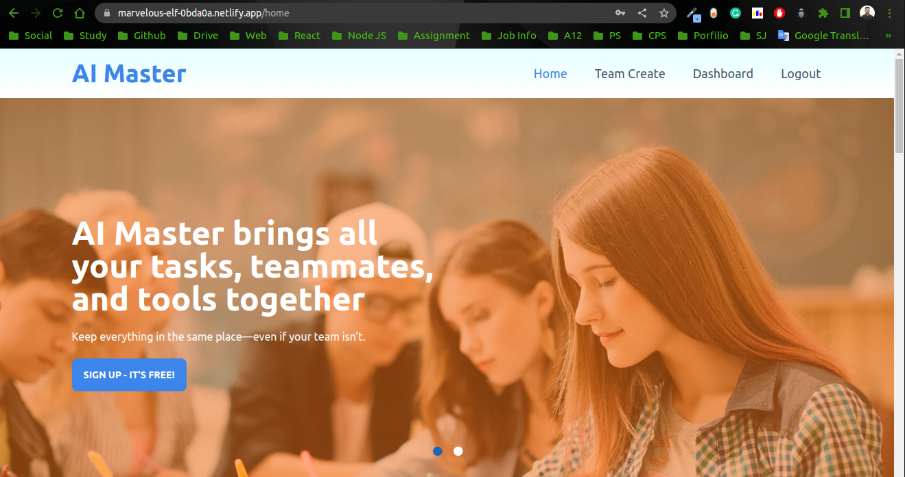
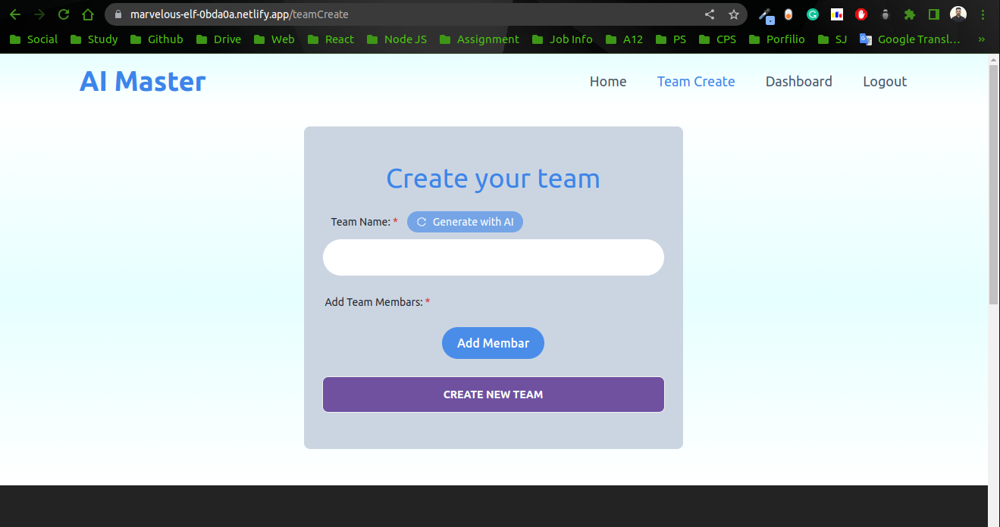
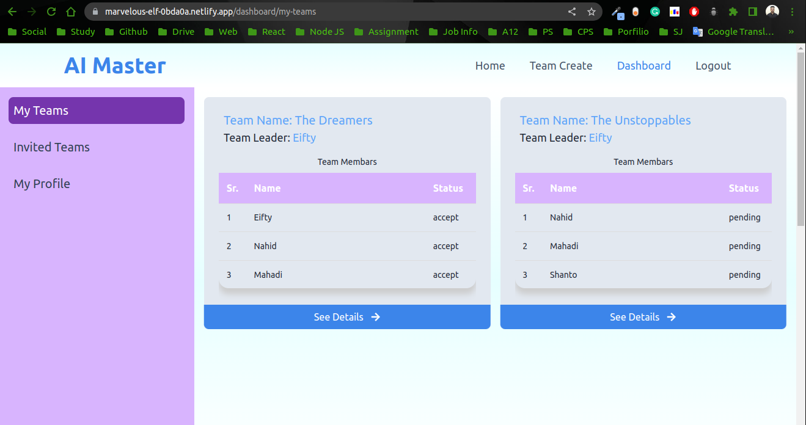
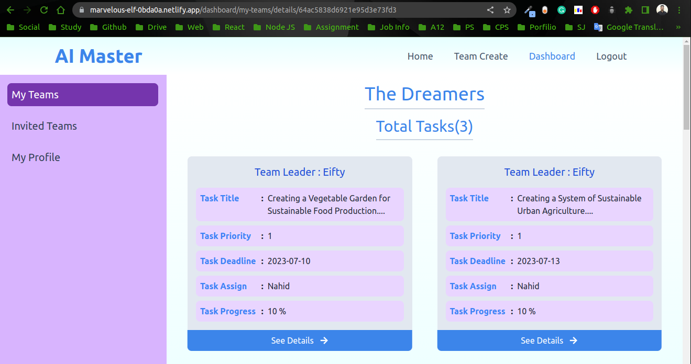
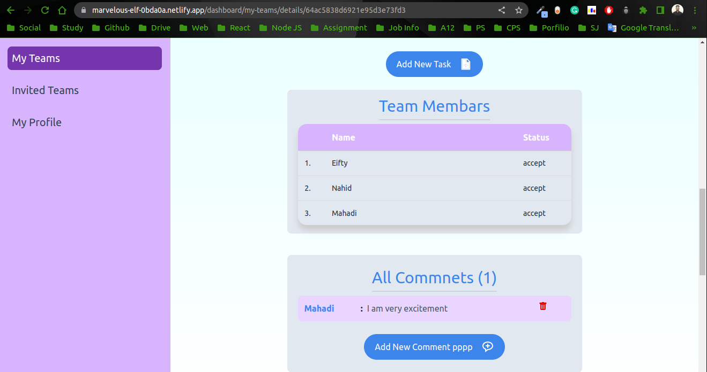
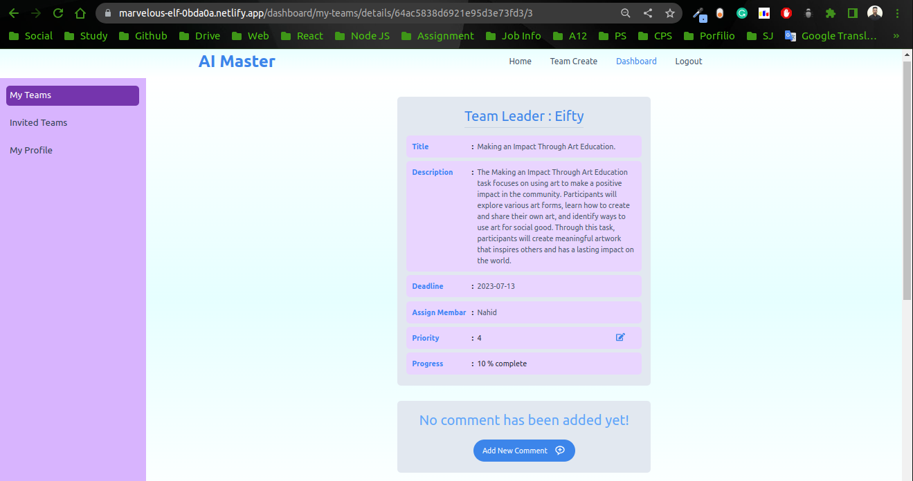
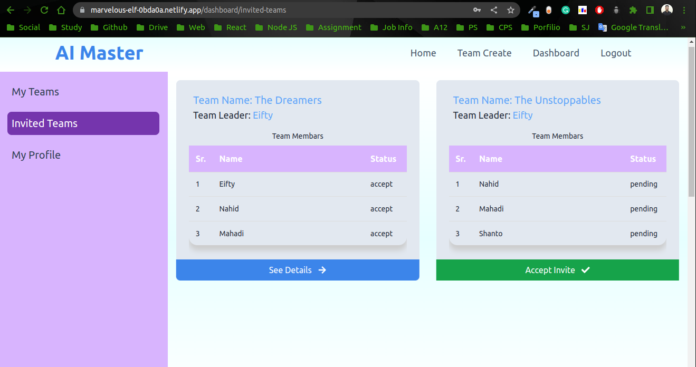
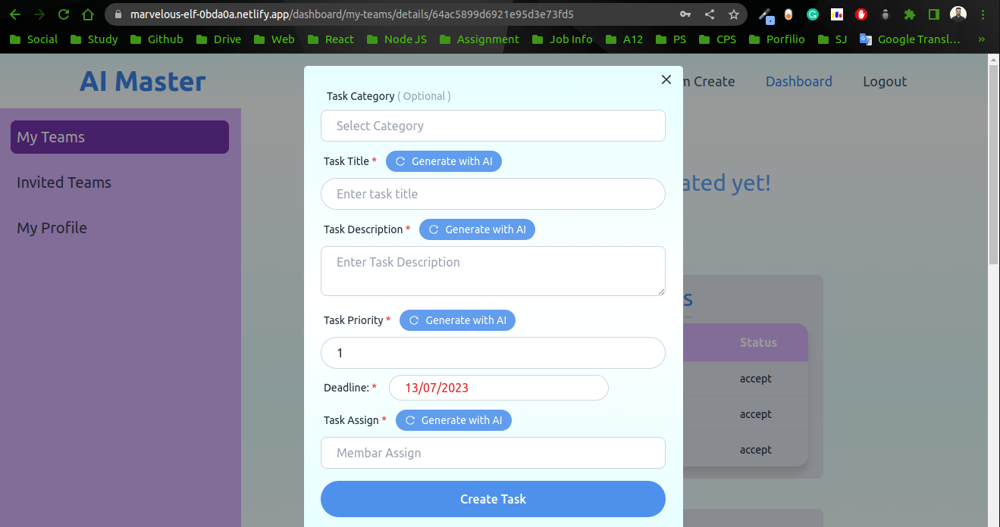
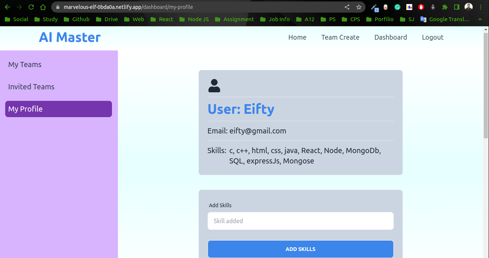

# AI Productivity Master 
 
* live site: [click here]( https://marvelous-elf-0bda0a.netlify.app/home)
* Project Review video: [click here](https://drive.google.com/file/d/1BNrNmPQ5pbj_8xGuCwWG9OKZpFNOe_ch/view?usp=sharing)

## Technology uses of this site:
### Front End:

* openai 
* React
* React-Query
* Context API
* react-slick
* react-toastify"
* react-icons 
* react-datepicker 
* firebase 
* Tailwind  

### Back End:

* Node 
* ExpressJs 
* Folllow MVC Pattern
* cors
* dotenv

### Features of this site:
* Mainly focused this project i try to use chatbot  help users  to create team and task title , description 
* And based on the task title AI sugests who should be asssigned the task for best performance

*  Provide options for users to create teams ans send invitations to join the team within the application
* Allow users to create tasks by providing a task, description, due date and priority level
* Provide the ability to assign tasks to specific team membars individually
* Enable users to comment on tasks
* Implement a real-time activity feed that captures task updates, comments, andprogress.

    
        
